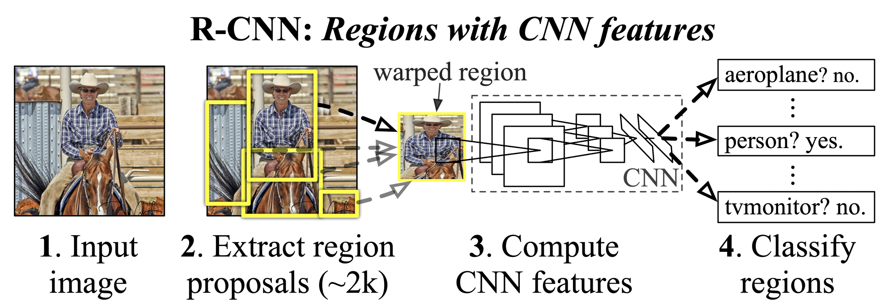

## 背景

在RCNN提出之前，目标检测一般是基于传统的特征提取方法做的（如HOG等），一个典型的pipeline是

1. 输入一张图片
2. 从图片中提取出一些局部区域，作为待检测区（又名Region Proposals，可使用滑窗、Selective Search等）
3. **基于传统的特征提取方法提取这些待检测区的特征（通常是经过复杂设计的基于规则的方式，如HOG）**
4. 基于提取的特征，通过机器学习算法（如SVM）进一步做分类
5. 输出不同Proposals的类别

## 核心思想

RCNN使用卷积神经网络，即CNN，替代上述第3步中的特征提取过程。期望以多层神经网络的形式抽象出更“高层”的特征信息，以获得更好的识别效果。

## Pipeline

1. 输入一张图片
2. 提取一些待检测区域（本文使用Selective Search）
3. 将所有待检测区域变形为特定的大小（CNN的输入维度固定）
4. 机器学习算法作分类（本文使用SVM）

## 亿些细节

### 如何使用CNN定位目标

- 思路1：直接使用CNN预测回归坐标的bounding box，但之前就有人尝试，效果不佳
- 思路2：滑动不同比例的窗口作region proposals，再使用CNN提取特征/分类，但比较适合比例较固定的目标（如人脸）
- 思路3：使用特定算法作region proposals，再使用CNN提取特征/分类（本文思路）

### 标注数据太少怎么办

当时的流行数据集
- ImageNet：图像分类，量大
- PASCAL VOC：图像检测，量少（目标数据集）

- 思路1：大数据集无监督预训练 + 小数据集有监督fine-tuning
- 思路2：大数据集有监督预训练 + 小数据集有监督fine-tuning（本文思路，迁移学习）

## 进一步了解

HOG（TODO）

Selective Search（TODO）

SVM（TODO）

mAP（TODO）

## 原文和代码

<https://arxiv.org/abs/1311.2524>

## 参考资料



